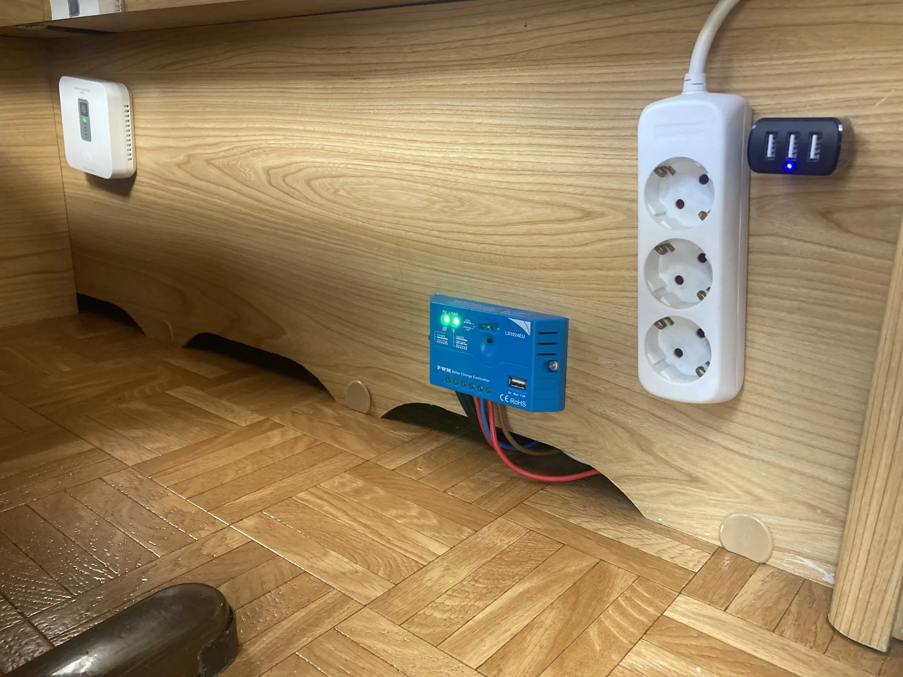
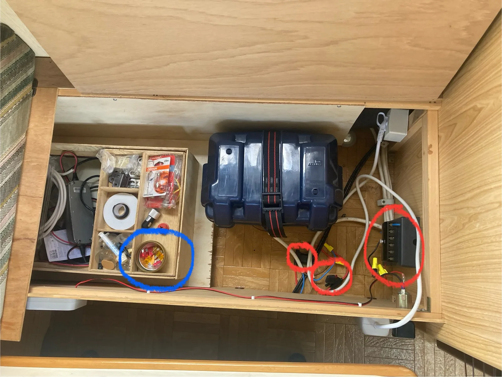
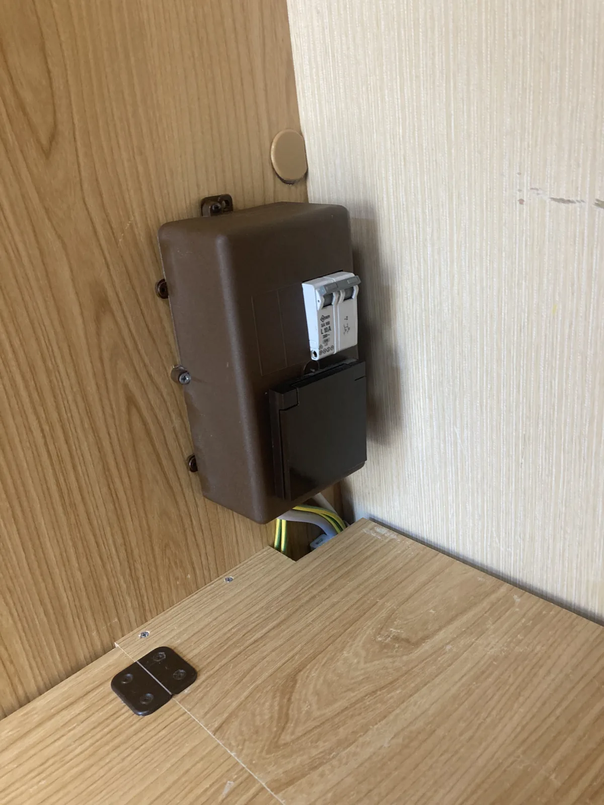

# El och batteri

Husvagnen har två elsystem:

| System | Används till |
|---|---|
| **220 V växelström** | Kylskåp och 220 V-uttag |
| **12 V likström/batteri** | Lampor, gasollarm, cigarettkontakt, vattenpump och fläkt till värmen |

Medan kylen också kan drivas på batteri rekommenderas det inte då batteriet tar slut väldigt fort.

## 12 V-systemet

Batteriet till 12 V-systemet laddas av solpanelen och är frikopplat från 220 V-systemet.

Det finns en reservladdare om batteriet behöver kopplas ur och laddas manuellt.

På den blå regulatorn visar de fyra små dioderna hur laddat batteriet är.

## Säkringar till 12 V

Under soffan sitter säkringar till 12 V-systemet. Extra säkringar finns också där. Se röda markeringar.

## Säkring till 220 V

Inne i garderoben sitter säkringen till 220 V-systemet.

