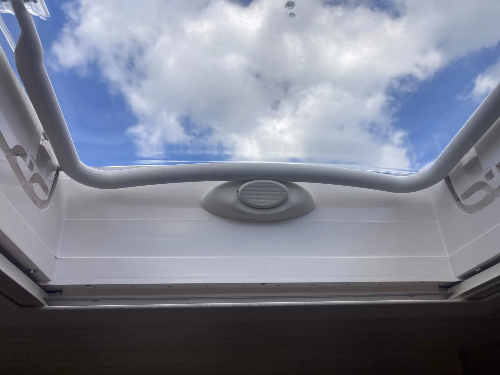
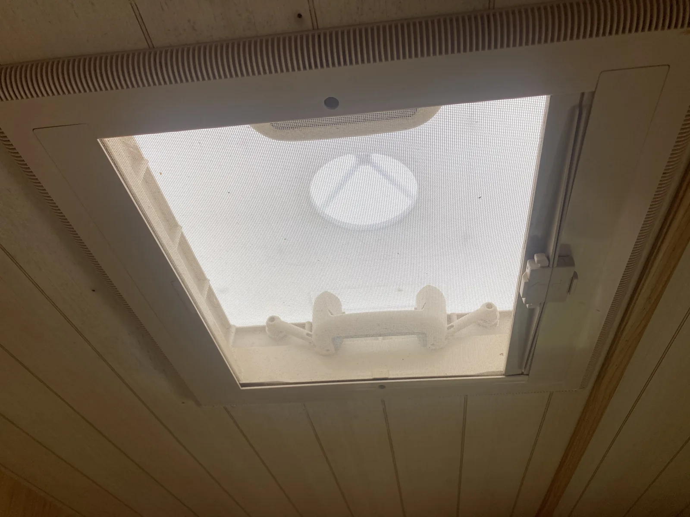
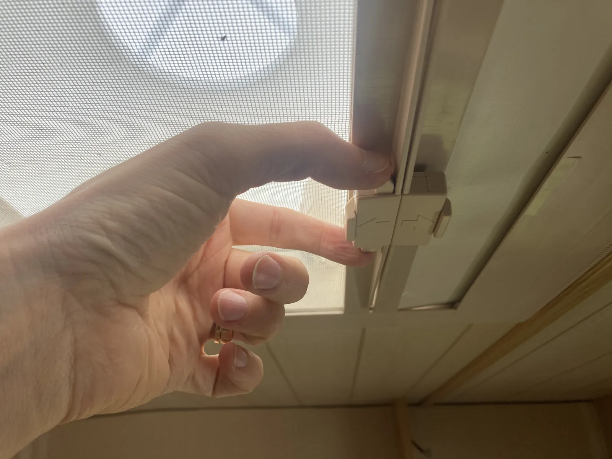
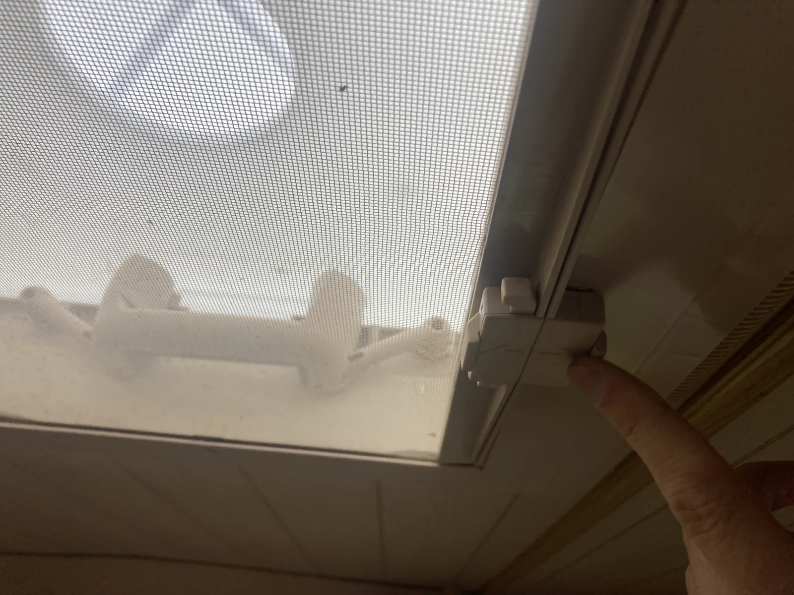
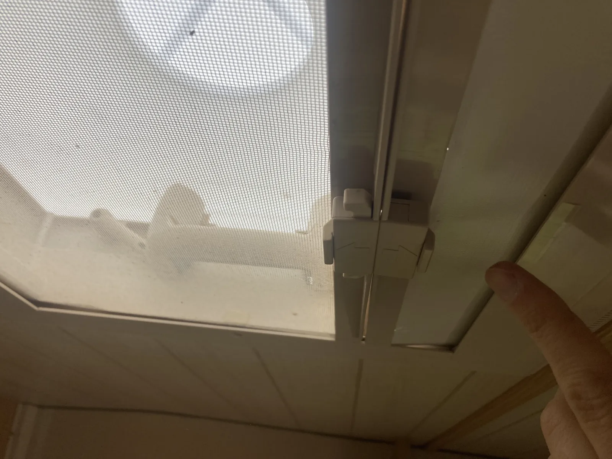

# Takluckor

Husvagnen har två takluckor. De ska användas olika beroende på om husvagnen står stilla eller körs.

!!! warning "Under färd"
    Takluckorna ska vara helt stängda under färd för att inte skadas.

## När ni bor i husvagnen

Takluckorna bör stå i ventilationsläge när ni bor i husvagnen, även när det regnar.

Båda takluckorna har myggnät och mörkläggning, men de fungerar lite olika.

## Taklucka i köket

Takluckan kan öppnas i flera lägen. På färd ska den vara helt stängd.

När man bor i husvagnen bör luckan vara i ventilationsläge.

Myggnät och mörkläggning dras för från vardera sida.

## Taklucka i barnkammaren

Så här ser barnkammarens taklucka ut när den är stängd. Myggnätet dras ut från vänster sida i bild och mörkläggningen från höger sida.

### Öppna takluckan

1. Koppla isär myggnätet från mörkläggninsgardinen (se bild)
2. Tryck in de mörkgrå spärrarna på båda sidor.
3. Tryck luckan uppåt kontrollerat men bestämt.

### Växla mellan myggnät och mörkläggning

1. Lossa mörkläggningen från fönstrets högra sida.
2. Dra för mörkläggningsgardinen.

